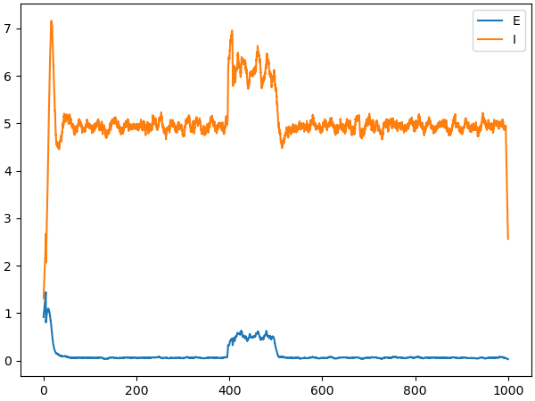

# A large-scale EI balanced network model





## Requirements

Before run the model, please install [brainpy](https://github.com/brainpy/BrainPy) first.

This model needs:

> brainpy>= 2.4.6.post5


## Citation

If you use this model in your research, please cite:


> Chaoming Wang, Tianqiu Zhang, Xiaoyu Chen, Sichao He, Shangyang Li, Si Wu (2023) BrainPy, a flexible, integrative, efficient, and extensible framework for general-purpose brain dynamics programming eLife 12:e86365
> https://doi.org/10.7554/eLife.86365


```bibtex
@article {10.7554/eLife.86365,
    article_type = {journal},
    title = {BrainPy, a flexible, integrative, efficient, and extensible framework for general-purpose brain dynamics programming},
    author = {Wang, Chaoming and Zhang, Tianqiu and Chen, Xiaoyu and He, Sichao and Li, Shangyang and Wu, Si},
    editor = {Stimberg, Marcel},
    volume = 12,
    year = 2023,
    month = {dec},
    pub_date = {2023-12-22},
    pages = {e86365},
    citation = {eLife 2023;12:e86365},
    doi = {10.7554/eLife.86365},
    url = {https://doi.org/10.7554/eLife.86365},
    abstract = {Elucidating the intricate neural mechanisms underlying brain functions requires integrative brain dynamics modeling. To facilitate this process, it is crucial to develop a general-purpose programming framework that allows users to freely define neural models across multiple scales, efficiently simulate, train, and analyze model dynamics, and conveniently incorporate new modeling approaches. In response to this need, we present BrainPy. BrainPy leverages the advanced just-in-time (JIT) compilation capabilities of JAX and XLA to provide a powerful infrastructure tailored for brain dynamics programming. It offers an integrated platform for building, simulating, training, and analyzing brain dynamics models. Models defined in BrainPy can be JIT compiled into binary instructions for various devices, including Central Processing Unit (CPU), Graphics Processing Unit (GPU), and Tensor Processing Unit (TPU), which ensures high running performance comparable to native C or CUDA. Additionally, BrainPy features an extensible architecture that allows for easy expansion of new infrastructure, utilities, and machine-learning approaches. This flexibility enables researchers to incorporate cutting-edge techniques and adapt the framework to their specific needs},
    journal = {eLife},
    issn = {2050-084X},
    publisher = {eLife Sciences Publications, Ltd},
}
```    


